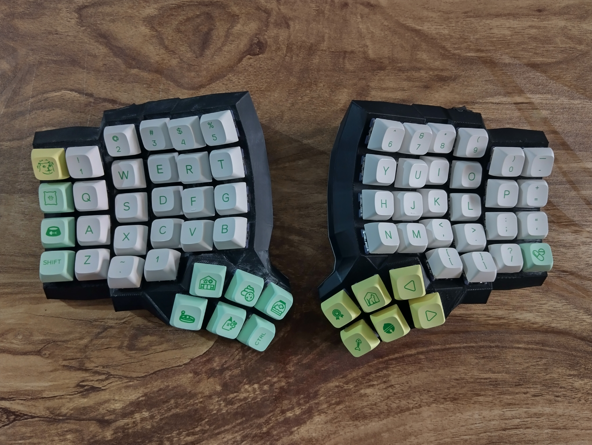

# Dactyl 5x6

This repository contains the ZMK firmware configuration and STL files for my Dactyl keyboard build.

## STL files

The STL files are generated using https://ryanis.cool/cosmos/. You can access my configuration using [this link][3dprintconfig].

## ZMK

The keymap defined in <./config/dactyl_56.keymap> is outdated since I have shifted to using zmk-studio to be able to change the mapping without re-flashing.

Sadly, zmk-studio does not provide a way to export your config to a file for reproducability. This means I will loose my keymap when I re-flash the firmware. This is not exactly true as explained [in this issue comment][zmk-studio-issue-comment], but I am not aware if it is possible to backup the on board keymap as of writing this.

## Sourcing the hardware

If you are looking to build a similar project and you live in India then the following table might help you.

<table border="1" cellspacing="0" cellpadding="6">
  <tr>
    <th>Name</th>
    <th>Source</th>
    <th>Price (INR)</th>
  </tr>
   <tr>
    <td>3D Prints</td>
    <td><a href="https://www.instagram.com/paws.3d">paws.3d</a></td>
    <td>2500</td>
  </tr>
  <tr>
    <td>SuperMini nRF52840 BLE controller</td>
    <td><a href="https://robokits.co.in/iot-wireless-solutions/iot-internet-of-things/iot-esp-module/supermini-nrf52840-pro-micro-bluetooth-le-ble-controller-arduino-compatible">Robokits</a></td>
    <td>1773</td>
  </tr>
  <tr>
    <td>Switches (Haimu Navy Jade Tactiles)</td>
    <td><a href="https://neomacro.in/products/haimu-navy-jade-tactiles">NeoMacro</a></td>
    <td>1395</td>
  </tr>
  <tr>
    <td>64 × 1N4148 diodes</td>
    <td rowspan="16"><a href="https://makerbazar.in/">MakerBazar</a></td>
    <td rowspan="16">1820</td>
  </tr>
  <tr><td>Hot glue gun</td></tr>
  <tr><td>Female–Female jumper wires</td></tr>
  <tr><td>10 mm Kapton tape</td></tr>
  <tr><td>5 mm copper tape</td></tr>
  <tr><td>Mini breadboard</td></tr>
  <tr><td>Nipper</td></tr>
  <tr><td>Batteries</td></tr>
  <tr><td>Battery protection circuit (<b>not used</b>)</td></tr>
  <tr><td>Soldering iron</td></tr>
  <tr><td>Solder wire</td></tr>
  <tr><td>Soldering Stand and Cleaning Sponge</td></tr>
  <tr><td>Push button switch (SPST, 2-pin)</td></tr>
  <tr><td>18 × M3 × 6 mm flat-head screws</td></tr>
  <tr><td>2 × M3 × 10 mm flat-head screws</td></tr>
  <tr><td>20 × M3 screw inserts</td></tr>
  <tr>
    <td>Rocker switches (2 pcs)</td>
    <td>Locally Sourced</td>
    <td>20</td>
  </tr>
  <tr>
    <td>64 × 1U DSA keycaps (Strange Cat set)</td>
    <td><a href="https://curiositycaps.in/products/strange-cat-104-26-xda-profile-keycap-pbt">CuriosityCaps</a></td>
    <td>2400</td>
  </tr>
  <tr>
    <td colspan="2" style="text-align:right;"><strong>Total</strong></td>
    <td><strong>9908</strong></td>
  </tr>
</table>

[3dprintconfig]: https://ryanis.cool/cosmos/beta#cm:Cp8BChUSBRCAbyAnEgASABIAOB5AgIaKwAcKGRIFEIBjICcSABIAEgMQsDsSAxCwazgKQAAKHBIFEIBXICcSABIAEgMQsC8SAxCwXzgJQIDwvAIKERIFEIBLICcSABIAEgA4HUAAChESBRCAPyAnEgASABIAODFAAAoYEgIgJxIAEgQQoIAKEgIQMDgyQICGisAHGABA7IWgrvBVSNzwoqABCqEBCisSExDAgAJAgICYAkjCmaCVkLwBUEMSEkCAgMwCSMKZoJWQvAFQhgFYOjgIChUSEBBAQICAIEjQlYDdkPUDUAtQngIKJxIQEEBAgID4AUjmmfynkAtQVxIRQICApANI8JnEtdAwUHRYlQFQfwoVEhBAkrbtDEj6mejs8PwCUIYBUIICGAIiCgjIARDIARgAIABAy4v8n9AxSK2R3I3BkwaCAQECWEhoAA==
[zmk-studio-issue-comment]: https://github.com/zmkfirmware/zmk-studio/issues/124#issuecomment-2662519535
